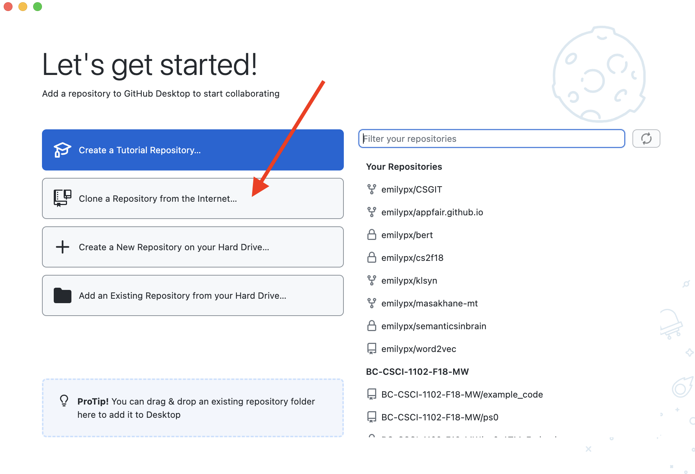
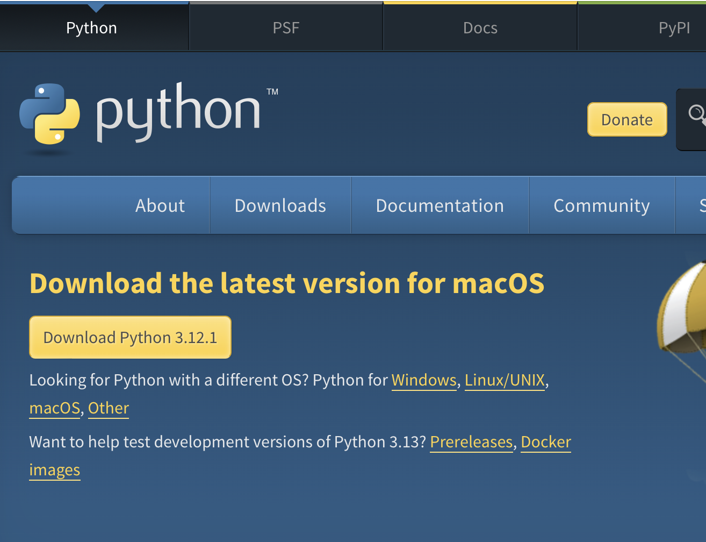
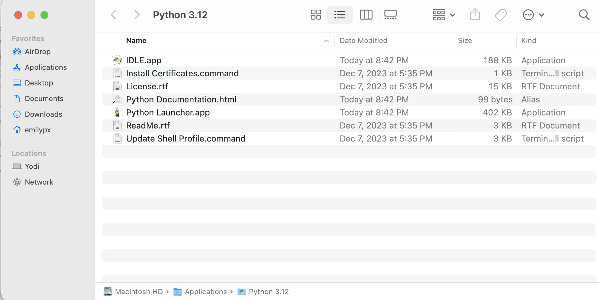
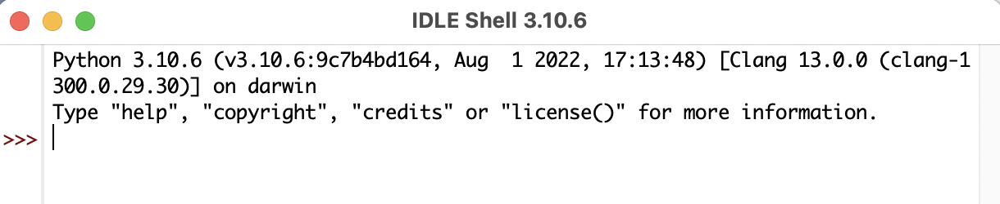

# Problem Set 1

Now that you have created a GitHub account and have accepted this invitation, you can finish the problem set. The deadline for this problem set is **January 19, at 11:59pm Boston time**. At the end of this problem set, I list all the components you are required to submit and how you must submit them.

## Part 1: Course Survey
[Take this short survey](https://forms.gle/c6LJ2QyRxktytCPa8)

## Part 2: Get started on Slack
Follow [this link to join the Slack workspace for this class](https://join.slack.com/t/csci1090s24/shared_invite/zt-2anzsi28g-kcsiPnm04dhh4q7sAsuGhw). Create your account if you don't have one and feel free to use a pseudonym for your username. Then post a message in the `#general` channel. Don't forget to `@prudhome` if you need my attention.

## Part 3: Download and Install GitHub Desktop
In this class, most assignments will be distributed and submitted using GitHub Classroom. The easiest way to manage GitHub for new users is through the GitHub Desktop application.

1. [Download GitHub Desktop from here.](https://desktop.github.com)
2. Find the installer in your Downloads folder (or wherever things get downloaded on your computer), then double click the installer to install GitHub Desktop. In most cases, this will install the program in your Downloads folder.
3. Launch GitHub Desktop. When you do this, it might ask you if you want to move it to a more appropriate location (e.g., Applications or Programs). You should agree to this, but remember where it is getting moved to so you can find it easily later! I suggest making a shortcut or alias on your Desktop.
4. Since you have already created a GitHub account in the first part of this problem set, you should sign in to GitHub.com when prompted, and authorize GitHub Desktop to access your GitHub Files.

## Part 4: Clone this repository to your own machine
This might be the trickiest part for many people. You are now going to use GitHub Desktop to make a copy of this repository on your own computer. It will just look like a normal folder on your computer, but it will actually be connected to your copy of this repository on the internet on GitHub. You can add files and change files in that folder, and then you will use GitHub Desktop to make those changes to your repository on GitHub. The repository on GitHub is what the TAs and I will grade, rather than a submission on Canvas.

1. Launch GitHub Desktop if you closed it before. If you have not already logged in and authorized it to access your GitHub account, follow the instructions it provides to do so now.

2. You should see a screen like this. Click on the second choice "Clone a Repository from the Internet..."



3. When you select that, you'll see a list of your repositories, including this one, as shown below. Select this repository, i.e., `CSCI1090-S24/ps1-yourusername`. Then in the `Local Path` box, change the path to something sensible -- like your Desktop or Documents and then a folder named for the class, as shown in the screenshot below.


4. Next you'll see a screen like this. If you want to see your local copy of your repo on your computer, you can click on the `Show in Finder` option (which will be something like `Show in File Explorer` in Windows).
 


6. On my Mac, this is what I see next. This is where you will be doing all the work for this problem set. At the end of the problem set, in step 9, you'll see how to commit your work to your repository on the internet on GitHub.


## Part 5: Download and install Python

1. Download Python for your operating system by clicking the big yellow "Download Python" button found on this webpage: https://www.python.org/downloads. It's okay if the version number is different. Python gets updated frequently!



2. It will probably get downloaded to your Downloads folder. Double click on the downloaded file to install Python on your computer. Answer the questions that the installer asks you and keep clicking the "Continue" button. You might have to enter your computer's password to complete the installation.

### *Important note for Windows users: You **must** check the box in the first dialogue window that says "Add Python 3.12 to PATH"!*

### *Important note for Mac users: Allow it to access files in Downloads!*


3. After installation is complete, your computer will probably open a window showing you where the various Python components were installed. On a Mac, it's in Applications by default. In Windows, the default location is in Programs. If you are having trouble finding the Python components you just installed, you can always search for "IDLE" the way you would search for any other file or program (e.g., with the Start menu in Windows, or on a Mac with Spotlight, the magnifying glass in the upper right corner). Here's a screenshot from my Mac showing where the installer installed Python. 



4. Strongly recommended: make a shortcut or alias to the IDLE application to your desktop so you always know where to find it. 


## Part 6: Write and run Python code from the IDLE interpreter

1. Launch the **IDLE** application (*not* python.exe or Python launcher.app). On a Mac it might be called ``IDLE.app``, and on a Windows machine it might be called ``IDLE.exe`` or ``IDLE.bat``. See Part 5, stem 3 to recall how to find it.

2. This will open a window that looks something like this.


 
3. Next to the ``>>>`` type a mathematical expression, like ``2+7`` or ``56/8``. Then hit return.

4. Now type your own personalized greeting to me and the TAs using the ``print`` command. Here's an example, below, of how the command should look, but you will replace ``Hello, world!`` with your own greeting. Don't forget to hit return after you type your command.

```print("Hello, world!")```

5. Take a screenshot of your IDLE window showing that you typed these commands, and move the screen shot into the folder on your computer for this repository (i.e., the one GitHub Desktop created called `ps1-yourusername`).

## Part 7: Write and run a Python program with IDLE

In this folder, you'll see a file called `ps1.py`.  (Your operating system might just show it as as `ps1`. That's fine -- it's the file you want.) 

In order to view and run this program in IDLE, you need to open it in IDLE. There are two ways of opening a Python (``.py``) file in IDLE.

**Option 1**

* Right-click on the `ps1.py` file. (On a Mac, you can right-click by tapping the icon with two fingers or by holding down the ``control`` key and then tapping the icon.)
* Select `Open with...` and then select IDLE from the submenu.
* If IDLE does not appear or you can't figure out how to right click, try option 2.

**Option 2**

* Launch IDLE. It might already be open from Part 6! 
* From the `File` menu in IDLE, select `Open`. Then navigate to the `ps1-yourusername` folder, and select `ps1.py`, which your OS might show just as `ps1`, without the `.py`.


Once you have launched IDLE and you have `ps1.py` open, click on the `ps1.py` window to make it the active window. Then go up to the `Run` dropdown menu, and select `Run Module`. In the `IDLE Shell` window, you'll see output something like this.

```
=========== RESTART: /Users/emilypx/Desktop/ps1.py ===========
Hello, World!
>>> 
```

You have successfully run your first Python program!You can now edit the program in the window where you opened it in IDLE.

1. Change the code in `ps1.py` to print out (1) "Hello, Boston College!", (2) the sum of 7 and 15, (3) any farewell message.
2. Save the program by selecting `Save` from the `File` menu or by using whatever shortcut you'd use to save a file in Word or Excel or any other app.
3. Run the program by selecting the `ps1.py` window and then going to `Run -> Run module`.
   

## Part 8: Make a Personal Slide

1. Using PowerPoint, Keynote, or Google Slides, create a single landscape mode PDF that contains the following information.

* Your name as it appears in Canvas.
* The name you prefer to be called.
* A photo of you that resembles what you currently look like.

2. Put the PDF in your folder that is the local clone of the repository.


## Part 9: Commit your work to GitHub Classroom using the GitHub Desktop app
---

**Reminder:** To receive full credit you must

* Complete the course survey (Part 1).
* Post a message on Slack (Part 2).
* Put the screenshot showing that you used the interpreter in IDLE (Part 6).
* Edit the `ps1.py` file in this directory (as described in Part 7).
* Put your personal PDF slide in this directory (Part 8).
* Commit this entire directory to GitHub Classroom (Part 9).

**All components of this problem set are due by Friday, January 19, by 11:59pm Boston time.**

---


